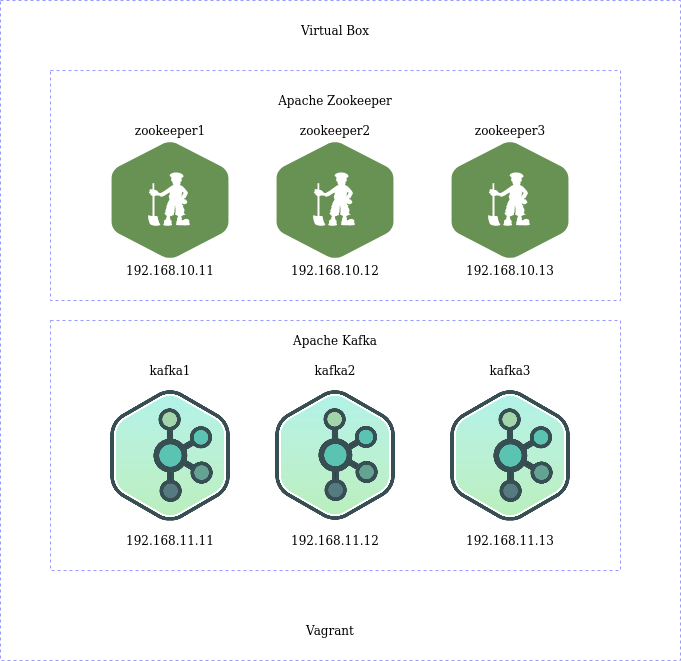

# kafka-vagrant-sandbox

## Content

In case you need a local cluster providing Kafka with ZooKeeper cluster, you are in right place.

* [Apache Kafka 3.0.0](https://kafka.apache.org/30/documentation.html)
* [Apache ZooKeeper 3.7.0](https://zookeeper.apache.org/doc/r3.7.0/index.html)

## Prerequisites
* [Vagrant](https://www.vagrantup.com) (tested with 2.2.18)
* [VirtualBox](http://virtualbox.org) (tested with 6.1.26)
* [Ansible]() (tested with 4.6.0)

# Install instructions on linux
* [Vagrant](https://www.vagrantup.com/downloads)
* [VirtualBox](https://www.virtualbox.org/wiki/Linux_Downloads)
* [Ansible](https://docs.ansible.com/ansible/latest/installation_guide/intro_installation.html#installing-and-upgrading-ansible-with-pip)


# Version checking
* Vagrant: 
  `vagrant --version`
* VirtualBox: 
  `vboxmanage --version`
* Ansible: 
`python -c 'from ansible_collections.ansible_release import ansible_version; print(ansible_version)'`


## Init

```bash
git clone https://github.com/awesome-enterprise/kafka-vagrant-sandbox.git

cd kafka-vagrant-sandbox

ansible-galaxy install andrewrothstein.zookeeper

chmod 600 ./shared-keys/ssh_key

vagrant up

cd ansible

ansible all -m ping

ansible-playbook network.yml

ansible-playbook cluster.yml
```

## Cluster

The result if everything wents fine should be



## Coordinates

#### Servers

| IP | Hostname | Description | Settings |
|---|---|---|---|
|192.168.10.11|zookeeper1|running a zookeeper instance| 512 MB RAM |
|192.168.10.12|zookeeper2|running a zookeeper instance| 512 MB RAM |
|192.168.10.13|zookeeper3|running a zookeeper instance| 512 MB RAM |
|192.168.11.11|kafka1|running kafka broker| 1024 MB RAM |
|192.168.11.12|kafka1|running kafka broker| 1024 MB RAM |
|192.168.11.13|kafka1|running kafka broker| 1024 MB RAM |

### Connections

| Name | address |
|---|---|
|Zookeeper|zookeeper1:2181,zookeeper2:2181,zookeeper3:2181|
|Kafka Brokers|kafka1:9092,kafka2:9092,kafka3:9092|

# Usage
## Zookeeper

```bash
[vagrant@zookeeper1 ~]$ zkCli.sh -server zookeeper1:2181
Connecting to zookeeper1:2181
Welcome to ZooKeeper!
JLine support is enabled

WATCHER::

WatchedEvent state:SyncConnected type:None path:null
[zk: zookeeper1:2181(CONNECTED) 1] ls /
[admin, brokers, cluster, config, consumers, controller, controller_epoch, feature, isr_change_notification, latest_producer_id_block, log_dir_event_notification, zookeeper]
[zk: zookeeper1:2181(CONNECTED) 4] ls /brokers/ids
[1, 2, 3]

```

## Kafka

### Topic Creation

```bash
[prog:~ prog]$ vagrant ssh kafka1
[vagrant@kafka1 ~]$  cd /opt/kafka
[vagrant@kafka1:/opt/kafka]$ bin/kafka-topics.sh --create --zookeeper zookeeper1:2181 --replication-factor 2 --partitions 6 --topic sample
Created topic "sample".
[vagrant@kafka1:/opt/kafka]$ bin/kafka-topics.sh --zookeeper zookeeper1 --topic sample --describe
Topic:sample	PartitionCount:6	ReplicationFactor:2	Configs:
	Topic: sample	Partition: 0	Leader: 1	Replicas: 1,2	Isr: 1,2
	Topic: sample	Partition: 1	Leader: 2	Replicas: 2,3	Isr: 2,3
	Topic: sample	Partition: 2	Leader: 3	Replicas: 3,1	Isr: 3,1
	Topic: sample	Partition: 3	Leader: 1	Replicas: 1,3	Isr: 1,3
	Topic: sample	Partition: 4	Leader: 2	Replicas: 2,1	Isr: 2,1
	Topic: sample	Partition: 5	Leader: 3	Replicas: 3,2	Isr: 3,2
[vagrant@kafka1:/opt/kafka]$
```
### Producer

```bash
[vagrant@kafka1:/opt/kafka]$ bin/kafka-console-producer.sh --broker-list kafka1:9092,kafka3:9092 --topic sample
Hey, is Kafka up and running?
```

### Consumer
On new console
```bash
[prog:~ prog]$ vagrant ssh kafka3
[vagrant@kafka-3 ~]$ cd /opt/kafka
[vagrant@kafka3:/opt/kafka]$ bin/kafka-console-consumer.sh --bootstrap-server kafka1:9092,kafka3:9092 --topic sample --from-beginning
Hey, is Kafka up and running?
```

